# SRX - Laboratoire Firewall

### Auteurs : Edin Mujkanovic et Daniel Oliveira Paiva

### Date : 27 mars 2019


##### 1. Introduction

Dans ce laboratoire il nous était de mettre en pratique les notions vues en classes sur *iptables*. En effet, nous avons configuré différentes règles qui permettaient, ou non, d'autoriser certains protocoles entre les différents réseaux (internet, DMZ et LAN).

##### 2. Regles de filtrages

Ci-dessous, le tableau demandé à l'étape des regles de filtrages que nous allons implémenter durant ce laboratoire :

| IP Source        | IP Destination   | Type               | Port source | Port destination | Action |
| ---------------- | ---------------- | ------------------ | ----------- | ---------------- | ------ |
| *                | *                | *                  | *           | *                | DROP   |
| 192.168.100.0/24 | eth0             | UDP Request        | 53          | 53               | Accept |
| eth0             | 192.168.100.0/24 | UDP Response       | 53          | 53               | Accept |
| 192.168.100.0/24 | eth0             | TCP                | 53          | 53               | Accept |
| eth0             | 192.168.100.0/24 | TCP                | 53          | 53               | Accept |
| 192.168.100.0/24 | eth0             | UDP                | 53          | 53               | Accept |
| eth0             | 192.168.100.0/24 | UDP                | 53          | 53               | Accept |
| 192.168.100.0/24 | eth0             | ICMP Echo Request  | 1           | 1                | Accept |
| eth0             | 192.168.100.0/24 | ICMP Echo Response | 1           | 1                | Accept |
| 192.168.100.0/24 | 192.168.200.0/24 | ICMP Echo Request  | 1           | 1                | Accept |
| 192.168.200.0/24 | 192.168.100.0/24 | ICMP Echo Response | 1           | 1                | Accept |
| 192.168.200.0/24 | 192.168.100.0/24 | ICMP Echo Request  | 1           | 1                | Accept |
| 192.168.100.0/24 | 192.168.200.0/24 | ICMP Echo Response | 1           | 1                | Accept |
| 192.168.100.0/24 | eth0             | TCP                | 80          | 80               | Accept |
| eth0             | 192.168.100.0/24 | TCP                | 80          | 80               | Accept |
| 192.168.100.0/24 | eth0             | TCP                | 8080        | 8080             | Accept |
| eth0             | 192.168.100.0/24 | TCP                | 8080        | 8080             | Accept |
| 192.168.100.0/24 | eth0             | TCP                | 443         | 443              | Accept |
| eth0             | 192.168.100.0/24 | TCP                | 443         | 443              | Accept |
| eth0             | 192.168.200.3    | TCP                | 80          | 80               | Accept |
| 192.168.200.3    | eth0             | TCP                | 80          | 80               | Accept |
| 192.168.100.0/24 | 192.168.200.3    | TCP                | 80          | 80               | Accept |
| 192.168.200.3    | 192.168.100.0/24 | TCP                | 80          | 80               | Accept |
| 192.168.100.3    | 192.168.200.3    | TCP                | *           | 22               | Accept |
| 192.168.200.3    | 192.168.100.3    | TCP                | 22          | *                | Accept |
| 192.168.100.3    | 192.168.100.2    | TCP                | *           | 22               | Accept |
| 192.168.100.2    | 192.168.100.3    | TCP                | 22          | *                | Accept |


##### 3. Configuration de base 

Dans ce chapitre, il nous était demandé d'effectuer un ping entre le Client_in_LAN et le Server_in_DMZ. A ce stade, aucune configuration n'a été effectuée. Comme vous pouvez le remarqué sur la capture d'écran ci-dessous, il nous était impossible de pinger le serveur : 

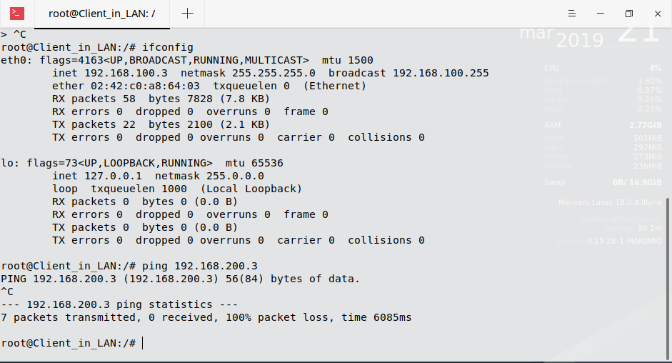

Après avoir effectué différentes configurations, nous pouvons remarquer que le ping entre le serveur de la DMZ et le client LAN est possible: 

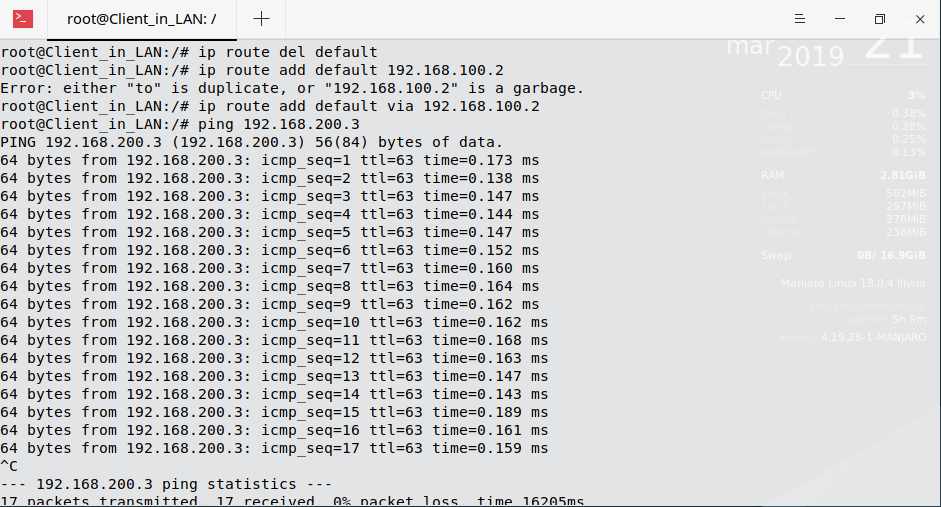

La dernière étape de cette section est de tester de pinger l'adresse *8.8.8.8* depuis le client ou le serveur. Nous pouvons remarquer ainsi que cela ne fonctionne pas : 

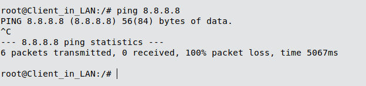

##### 4. Tests des connections et exemple de l'application d'une règle

Dans ce chapitre, il nous est demandé de configurer les règles pour que le pare-feu accepte : 

- les ping depuis le LAN sur les machines de la DMZ,
- les ping depuis le LAN sur le WEB,
- les ping depuis la DMZ vers le LAN.

Ci-dessous, les commandes *iptables* effectuées qui permettent d'attendre les objectifs demandés : 

**LAN TO DMZ :**

 ```
iptables -A FORWARD -s 192.168.100.0/24 -d 192.168.200.0/24 -p icmp --icmp-type 8 -j ACCEPT
iptables -A FORWARD -s 192.168.100.0/24 -d 192.168.200.0/24 -p icmp --icmp-type 0 -j ACCEPT
 ```

**DMZ TO LAN :**

```
iptables -A FORWARD -s 192.168.200.0/24 -d 192.168.100.0/24 -p icmp --icmp-type 8 -j ACCEPT
iptables -A FORWARD -s 192.168.200.0/24 -d 192.168.100.0/24 -p icmp --icmp-type 0 -j ACCEPT
```

**LAN TO WAN :**

```
iptables -A FORWARD -s 192.168.100.0/24 -p icmp --icmp-type 8 -o eth0 -j ACCEPT
iptables -A FORWARD -d 192.168.100.0/24 -p icmp --icmp-type 0 -i eth0 -j ACCEPT
```


Nous pouvons remarquer que si nous essayons de pinger l'adresse 8.8.8.8, cela va réussir, contrairement à avant : 

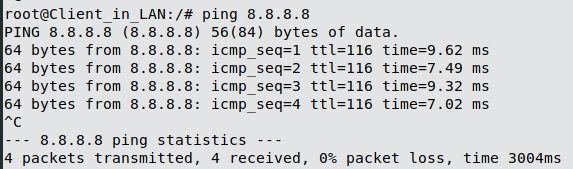


Ci-dessous, un tableau résumant toutes les règles mises en place :

| De Client\_in\_LAN à | OK/KO | Commentaires et explications                                 |
| :------------------- | :---: | :----------------------------------------------------------- |
| Interface DMZ du FW  |  KO   | Tous les input du firewall sont drops.                       |
| Interface LAN du FW  |  KO   | Tous les input du firewall sont drops.                       |
| Client LAN           |  OK   | Le client étant la source et la destination, le ping est permis. |
| Serveur WAN          |  OK   | Les régles que l'on a instaurées nous le permettent.         |

| De Server\_in\_DMZ à | OK/KO | Commentaires et explications                                 |
| :------------------- | :---: | :----------------------------------------------------------- |
| Interface DMZ du FW  |  KO   | Tous les input du firewall sont drops.                       |
| Interface LAN du FW  |  KO   | Tous les input du firewall sont drops.                       |
| Serveur DMZ          |  OK   | Le client étant la source et la destination, le ping est permis. |
| Serveur WAN          |  KO   | Aucune régle du FW n'autorise ce traffic.                    |


##### 5. Règles pour le protocole DNS

 Dans ce chapitre il nous est demandé de configurer le firewall afin qu'il autorise les requêtes DNS. Comme nous pouvons le voir ci-dessous, il nous est impossible de pinger le nom de domaine *google.ch*: 

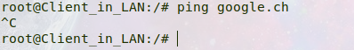

Nous pouvons également remarquer que le ping n'est même pas entamé car en effet, la machine Client_in_LAN ne sait pas à quelle adresse IP envoyé les pings.

Afin de palier à ce problème, nous avons effectués ces différentes commandes sur le firewall : 

```
iptables -A FORWARD -d 192.168.100.0/24 -i eth0 -p udp --sport 53 -m state --state ESTABLISHED -j ACCEPT
iptables -A FORWARD -s 192.168.100.0/24 -o eth0 -p udp --dport 53 -m state --state NEW,ESTABLISHED -j ACCEPT
iptables -A FORWARD -d 192.168.100.0/24 -i eth0 -p tcp --sport 53 -m state --state ESTABLISHED -j ACCEPT
iptables -A FORWARD -s 192.168.100.0/24 -o eth0 -p tcp --dport 53 -m state --state NEW,ESTABLISHED -j ACCEPT
```

Après avoir effectués, il nous était possible de pinger le nom de domaine de google : 

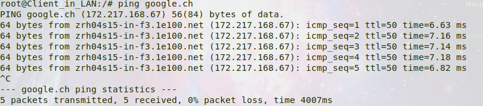

##### 6. Règles pour les protocoles HTTP et HTTPS

Dans ce chapitre, il nous est demandé de configurer les règles afin que : 

- Les clients du **LAN** doivent pouvoir ouvrir des connexions HTTP pour accéder au web. Le protocole HTTP utilise les ports TCP 80 et typiquement aussi le 8080.

- Les clients du **LAN** doivent pouvoir ouvrir des connexions HTTPS pour accéder au web. Le protocole HTTPS utilise le port TCP 443.
- Le serveur **web en DMZ** doit être atteignable par le WAN et le LAN et n'utilise que le port 80.


Les règles utilisées pour atteindre les objectifs des deux premiers points sont les suivantes : 

```
iptables -A FORWARD -s 192.168.100.0/24 -o eth0 -p tcp --dport 80 -m state --state NEW,ESTABLISHED -j ACCEPT
iptables -A FORWARD -d 192.168.100.0/24 -i eth0 -p tcp --sport 80 -m state --state ESTABLISHED -j ACCEPT
iptables -A FORWARD -d 192.168.100.0/24 -o eth0 -p tcp --sport 8080 -m state --state ESTABLISHED -j ACCEPT
iptables -A FORWARD -s 192.168.100.0/24 -i eth0 -p tcp --dport 8080 -m state --state NEW,ESTABLISHED -j ACCEPT
iptables -A FORWARD -s 192.168.100.0/24 -o eth0 -p tcp --dport 443 -m state --state NEW,ESTABLISHED -j ACCEPT
iptables -A FORWARD -d 192.168.100.0/24 -i eth0 -p tcp --sport 443 -m state --state ESTABLISHED -j ACCEPT
```

Les règles utilisées pour atteindre le dernier objectif sont les suivantes : 

```
iptables -A FORWARD -s 192.168.100.0/24 -d 192.168.200.3 -p tcp --dport 80 -m state --state NEW,ESTABLISHED -j ACCEPT
iptables -A FORWARD -s 192.168.200.3 -d 192.168.100.0/24 -p tcp --sport 80 -m state --state ESTABLISHED -j ACCEPT
iptables -A FORWARD -i eth0 -d 192.168.200.3 -p tcp --dport 80 -m state --state NEW,ESTABLISHED -j ACCEPT
iptables -A FORWARD -s 192.168.200.3 -o eth0 -p tcp --sport 80 -m state --state ESTABLISHED -j ACCEPT
```

Nous pouvons remarquer que désormais, la commande *wget* fonctionne : 

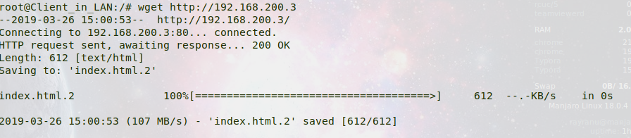

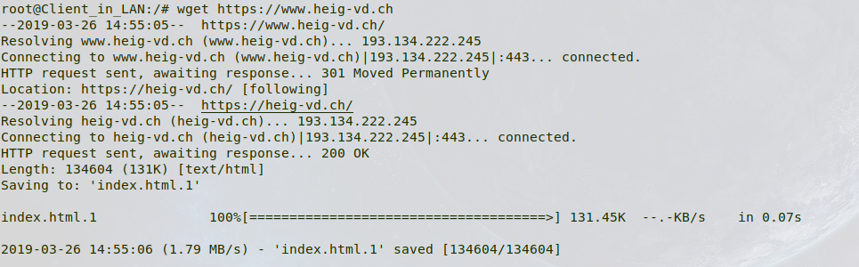

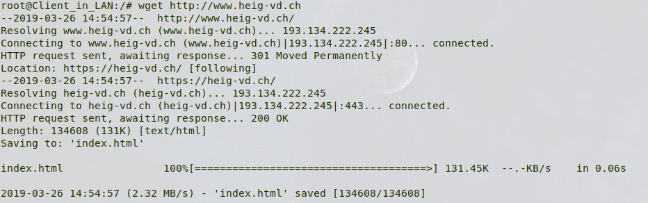


##### 7. Règles pour le protocole ssh

 Dans ce chapitre, il nous est demandé d'appliquer les règles afin de pouvoir : 

- Le serveur de la DMZ peut être commandé à distance par **ssh** depuis votre client du LAN **uniquement**. Le service ssh utilise le port TCP 22.

- Le firewall peut être configuré à distance par **ssh** depuis votre client du LAN **uniquement**.

Ssh permet d'ouvrir une connexion sécurisée à distance sur un serveur ou tout autre matériel. Cette dernière nous permettra d'ouvrir un terminal sur l'appareil cible afin de l'administrer.

Afin de pouvoir atteindre les deux objectifs : 

```
iptables -A FORWARD -s 192.168.100.3 -d 192.168.200.3 -p tcp --dport 22 -m state --state NEW,ESTABLISHED -j ACCEPT
iptables -A FORWARD -s 192.168.200.3 -d 192.168.100.3 -p tcp --sport 22 -m state --state ESTABLISHED -j ACCEPT


iptables -A INPUT -s 192.168.100.3 -p tcp --dport 22 -m state --state NEW,ESTABLISHED -j ACCEPT
iptables -A OUTPUT -d 192.168.100.3 -p tcp --sport 22 -m state --state ESTABLISHED -j ACCEPT
```


Ci-dessous, une capture d'écran présentant la bonne connexion ssh entre le client LAN et le serveur présent en DMZ : 

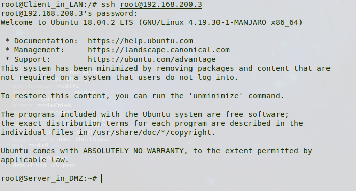


Il faut faire très attention à n'autoriser que les machines et appareils autorisés à se connecter sur le terminal distant lorsque l'on configure un pare-feu sur ces règles de connexion. 

##### 8. Règles finales iptables

Ci-dessous, une capture d'écran présentant toutes les régles implémentées durant ce laboratoire. Comme nous pouvons le remarquer, tout traffic est interdit sauf les régles spécifiées : 

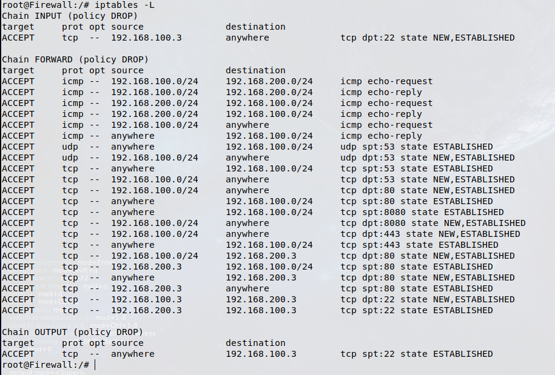
